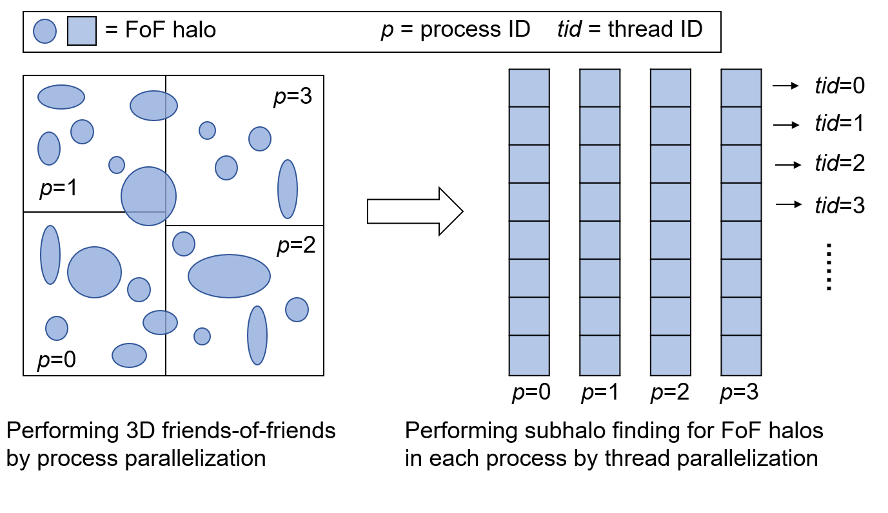
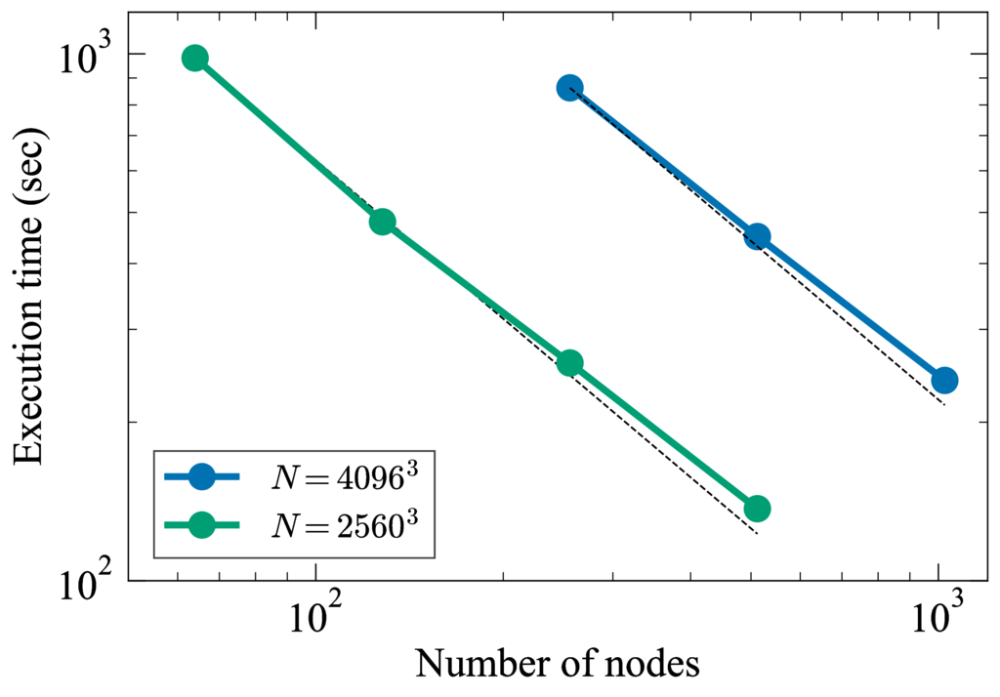

# Summary

According to the concordance cosmological theory, structure
formation and evolution proceeds hierarchically in the Universe.
Smaller-scale dark matter structures gravitationally collapse first
everywhere in the Universe, then merge into larger-scale structures.
Such dense gravitationally bound structures of dark matter are called
halos.  Halos can host smaller halos, so-called subhalos (or
substructures).  Cosmological $N$-body simulations are vital in
understanding the formation and evolution of halos and subhalos.
Halo/subhalo finders are a post-processing step to identify those dense
structures in the particle dataset of cosmological $N$-body
simulations.

MPI-Rockstar is a massively parallel halo finder
based on the [Rockstar](https://bitbucket.org/gfcstanford/rockstar/)
phase-space temporal halo finder code [@Behroozi2013], which is one of
the most extensively used halo finding codes.  Compared to the
original code, parallelized by a primitive socket communication
library, we parallelized it in a hybrid way using MPI and OpenMP,
which is suitable for analysis on the hybrid shared and distributed memory
environments of modern supercomputers.  This implementation can easily
handle the analysis of more than a trillion particles on more than
100,000 parallel processes, enabling the production of a huge dataset
for the next generation of cosmological surveys.

# Statement of need 

Owing to the advance of supercomputing power and highly scalable
parallel gravitational $N$-body codes [@Ishiyama2009b; @Ishiyama2012;
@Potter2017; @Wang2018; @Garrison2021], the number of particles in
recent massive cosmological simulations exceeds a trillion
[@Potter2017; @Ishiyama2021; @Wang2022], posing significant challenges
for halo finding.  Several halo finding algorithms have been
suggested [@Knebe2013], and some of their implementation are publicly
available [@Knollmann2009; @Behroozi2013; @Elahi2019; @Springel2021].
The computational performance of these implementations differs substantially,
and they have not been uniformly tested yet on the large-scale hybrid shared and distributed
memory environments of modern supercomputers.  MPI-Rockstar addresses
these issues and is designed to run on more than 100,000 parallel
processes in a hybrid way using MPI and OpenMP.  As new functions to
the original Rockstar code, MPI-Rockstar supports HDF5 as an output format and can
output additional halo properties such as the inertia tensor.

# Parallelization 

As a process parallelization, the original Rockstar divides a
simulation box by the number of parallel processes and assigns each
sub-box to each process.  Then, each process performs 3D
Friends-of-Friends (FoF) to find overdense regions, and FoF halos
across processes are linked by communicating boundary
regions. Rockstar then performs the subhalo finding for each FoF halo
using 6D phase space information.  Data communications between
multiple processes are performed by one-to-one communications using
sockets.  As a result, many sockets (file descriptors) are issued
simultaneously in the case of analysis with many processes, complicating
analysis on modern supercomputers because the number of file
descriptors issued simultaneously is normally limited. 

In MPI-Rockstar, we replaced all socket communications in the original
Rockstar with Message Passing Interface (MPI) communications, while
maintaining compatibility with the analysis results. Rather than
simply using MPI one-to-one communication, we changed the order of
communication and computation to utilize collective communications and
to run efficiently on large supercomputers. Furthermore, we
parallelized MPI-Rockstar in a hybrid way, where thread
parallelization is implemented within each process using OpenMP.  The
subhalo finding is parallelized not only on a process level but also
on a thread level, improving the overall performance of MPI-Rockstar.
This hybrid parallel design also reduces the risk of per-process
out-of-memory compared with a flat-MPI configuration. 
The below figure illustrates this parallelization storategy. 

The below figure shows a strong scaling of MPI-Rockstar using up to 1,024
nodes (48 CPU cores per node) on supercomputer Fugaku.  The horizontal
and vertical axes represent the number of computational nodes and the
time taken for the halo and subhalo finding of one snapshot,
respectively.  The blue and green curves show the strong scaling for simulations with
40963 particles in a 2 Gpc/h box and with 25603
particles in a 400 Mpc/h box, respectively The redshift of the
snapshot analyzed was 2.0. 
We measured the code's performance using 2 MPI
processes per node and 24 OpenMP threads per process.
This choice gives an optimal configulation for these snapshots,
considering the balance between the computation and I/O time.
The parallel efficiency is excellent, 
~90% for both the 40963 box from 256 to 1024 nodes 
and the 25603 box from 256 to 1024 nodes.
Thanks to the communication optimization and hybrid parallelization,
MPI-Rockstar could run up to three times faster than the original
Rockstar when compared in the same execution environment.  We confirm
that MPI-Rockstar can analyze 2 trillion particle simulations on
16,384 nodes (786,432 CPU cores) of Fugaku.

# Acknowledgements 

This work has been supported by IAAR Research Support Program in Chiba
University Japan, MEXT/JSPS KAKENHI (Grant Number JP23H04002), MEXT as
``Program for Promoting Researches on the Supercomputer Fugaku''
(JPMXP1020230406 and JPMXP1020230407), and JICFuS.  This work was
partially supported by the Sasakawa Scientific Research Grant from The
Japan Science Society.  Numerical computations were carried out on the
supercomputer Fugaku provided by the RIKEN Center for Computational
Science (Project ID: hp230173, and hp240184).

# References